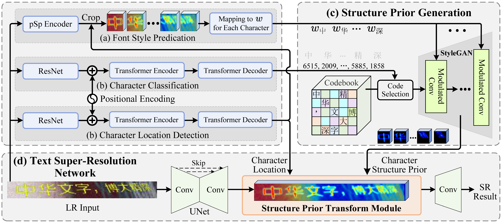
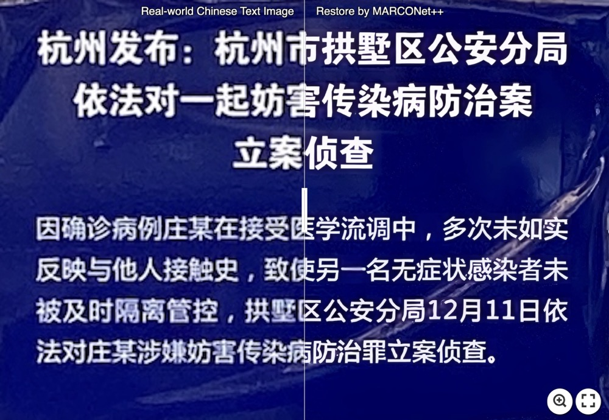
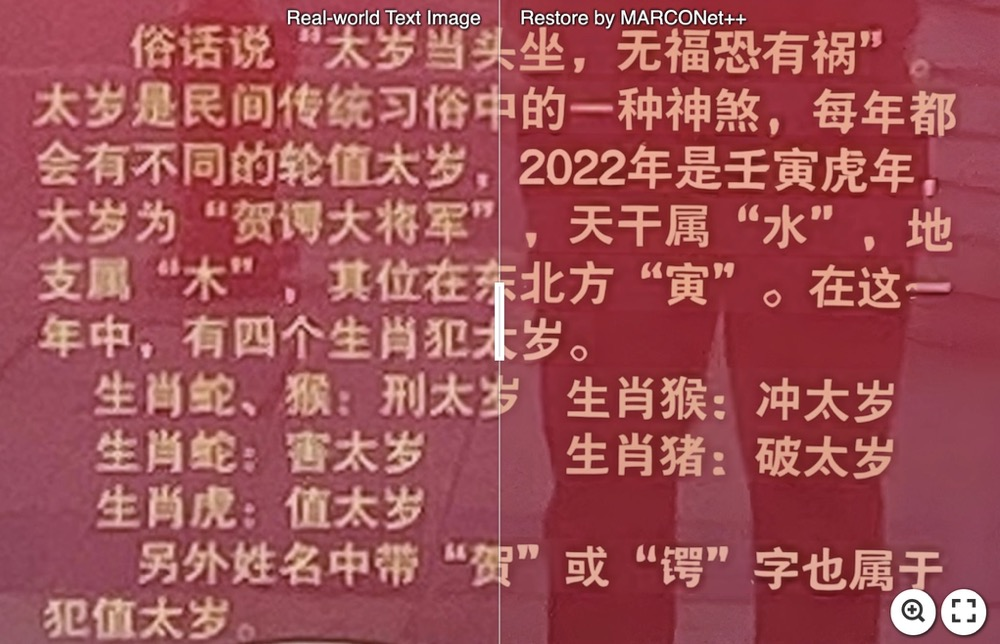
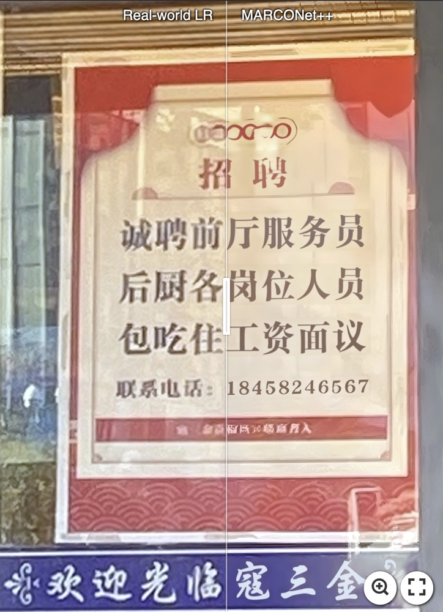
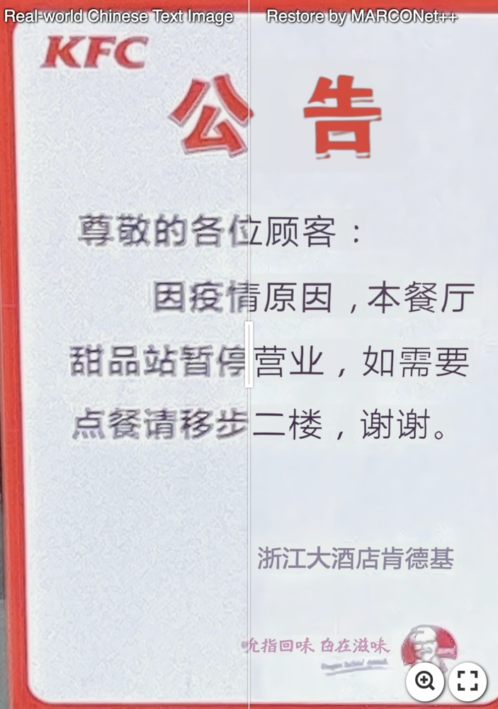
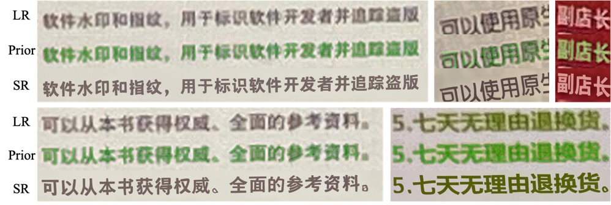
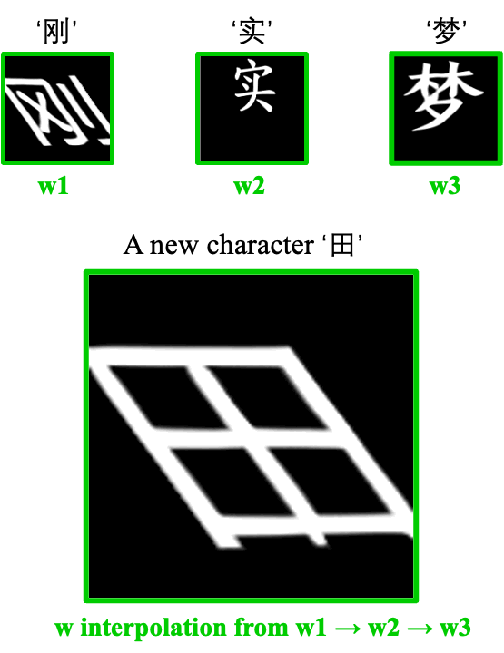
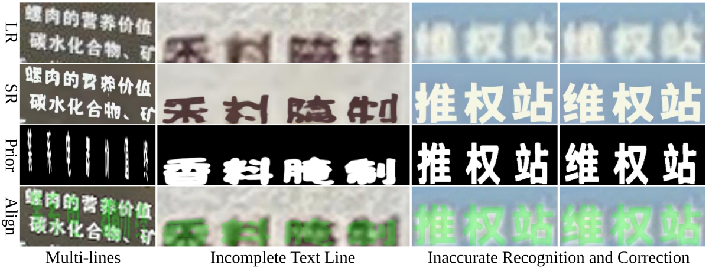

<div align="center">
  
  ## [Enhanced Generative Structure Prior for Chinese Text Image Super-Resolution](https://arxiv.org/pdf/2508.07537)

[Xiaoming Li](https://csxmli2016.github.io/), [Wangmeng Zuo](https://scholar.google.com/citations?hl=en&user=rUOpCEYAAAAJ&view_op=list_works), [Chen Change Loy](https://www.mmlab-ntu.com/person/ccloy/)

S-Lab, Nanyang Technological University

</div>


### 👷 The whole framework:
<div align="center">

</div>


<!-- 
<p align="justify">Faithful text image super-resolution (SR) is challenging because each character has a unique structure and usually exhibits diverse font styles and
layouts. While existing methods primarily focus on English text, less attention has been paid to more complex scripts like Chinese. In this paper, we introduce a high-quality text image SR framework designed to restore the precise strokes of low-resolution (LR) Chinese characters. Unlike methods that rely on character recognition priors to regularize the SR task, we propose a novel structure prior that offers structure-level guidance to enhance visual quality. Our framework incorporates this structure prior within a StyleGAN model, leveraging its generative capabilities for restoration. To maintain the integrity of character structures while accommodating various font styles and layouts, we implement a codebook-based mechanism that restricts the generative space of StyleGAN. Each code in the codebook represents the structure of a specific character, while the vector $w$ in StyleGAN controls the character's style, including typeface, orientation, and location. Through the collaborative interaction between the codebook and style, we generate a high-resolution structure prior that aligns with LR characters both spatially and structurally. Experiments demonstrate that this structure prior provides robust, character-specific guidance, enabling the accurate restoration of clear strokes in degraded characters, even for real-world LR Chinese text with irregular layouts.  </p>
-->

### 👷 Character Structure Prior Pretraining:
<div align="center">

</div>


## 🔔 [MARCONet](https://github.com/csxmli2016/MARCONet) *VS.* [MARCONet++]()
> - MARCONet is designed for **regular character layout** only. See details of [MARCONet](https://github.com/csxmli2016/MARCONet).
> - MARCONet++ has more accurate alignment between character structural prior (green structure) and the degraded image.
<div align="center">

</div>


## 📋 TODO
- [x] Release the inference code and model.
- [ ] Release the training code (no plans to release for now). 


## 🚶 Getting Started

```
git clone https://github.com/csxmli2016/MARCONetPlusPlus
cd MARCONetPlusPlus
conda create -n mplus python=3.8 -y
conda activate mplus
pip install -r requirements.txt
```

## 🚶 Inference
Download the pre-trained models
```
python utils/download_github.py
```

and run for restoring **text lines:**
```
CUDA_VISIBLE_DEVICES=0 python test_marconetplus.py -i ./Testsets/LR_TextLines -a -s
```
or run for restoring **the whole text image:**
```
CUDA_VISIBLE_DEVICES=0 python test_marconetplus.py -i ./Testsets/LR_Whole -b -s
```

```
# Parameters:
-i: LR input path, default: ./Testsets/LR_TextLines or ./Testsets/LR_TextWhole
-o: save path, default: None will automatically make the saving dir with the format of '[LR path]_TIME_MARCONetPlus'
-a: if the input is text lines, use -a; otherwise, the input is the whole text image and needs text line detection, do not use -a
-b: when restoring the whole text images, use -b to restore the background region with BSRGAN
-s: if you want to see the details of prior alignment, predicted characters, and locations, use -s 
```


## 🏃 Restoring Real-world Chinese Text Images
> We use [BSRGAN](https://github.com/cszn/BSRGAN) to restore the background region

[](https://imgsli.com/NDA2MDUw) [](https://imgsli.com/NDA2MDYw) 

[](https://imgsli.com/NDA2MTE0) [](https://imgsli.com/NDA2MDYy) 


## 🏃 Restoring detected text line




## 🏃 Style w interpolation from three characters with different styles 



## ‼️ Failure Case
Despite its high-fidelity performance, MARCONet++ still struggles in some real-world scenarios as it highly relies on:

- Real world character **Recognition** on complex degraded text images
- Real world character **Detection** on complex degraded text images
- Text line detection and segmentation
- Domain gap between our synthetic and real-world text images




> 🍒 Restoring complex character with high fidelity under such conditions has significant challenges.
We have also explored various approaches, such as training OCR models with Transformers and using YOLO or Transformer-based methods for character detection, but these methods generally encounter the same issues. 
We encourage any potential collaborations to jointly tackle this challenge and advance robust, high-fidelity text restoration.


## 📎 RealCE-1K benchmark
To quantitatively evaluate real-world Chinese text images, we filter out images from the test set of [RealCE](https://github.com/mjq11302010044/Real-CE) that have multiple text lines and have inaccurate labels, constructing a Chinese text SR benchmark. You can download it from [here](https://github.com/csxmli2016/MARCONetPlusPlus/releases/download/v1/RealCE-1K.zip).

## 🍗 Acknowledgement
This project is built based on the excellent [KAIR](https://github.com/cszn/KAIR) and [RealCE](https://github.com/mjq11302010044/Real-CE).

## ©️ License
This project is licensed under <a rel="license" href="https://github.com/csxmli2016/MARCONetPlusPlus/blob/main/LICENSE">NTU S-Lab License 1.0</a>. Redistribution and use should follow this license.


## 🍻 Citation
```
@article{li2025marconetplus,
  author = {Li, Xiaoming and Zuo, Wangmeng and Loy, Chen Change},
  title = {Enhanced Generative Structure Prior for Chinese Text Image Super-Resolution},
  journal = {IEEE Transactions on Pattern Analysis and Machine Intelligence},
  year = {2025}
}

@InProceedings{li2023marconet,
  author = {Li, Xiaoming and Zuo, Wangmeng and Loy, Chen Change},
  title = {Learning Generative Structure Prior for Blind Text Image Super-resolution},
  booktitle = {Proceedings of the IEEE/CVF Conference on Computer Vision and Pattern Recognition},
  year = {2023}
}
```


